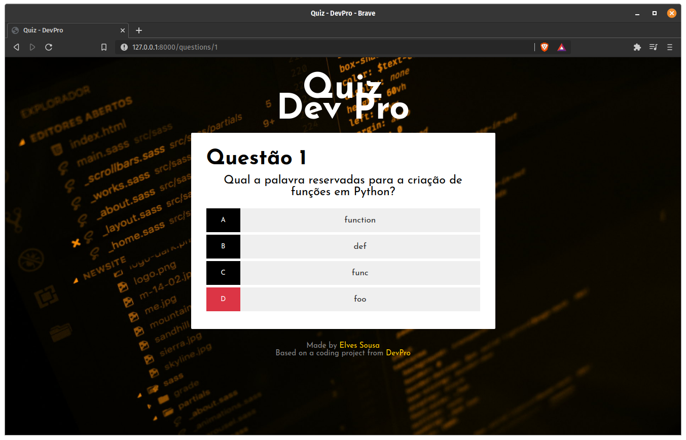
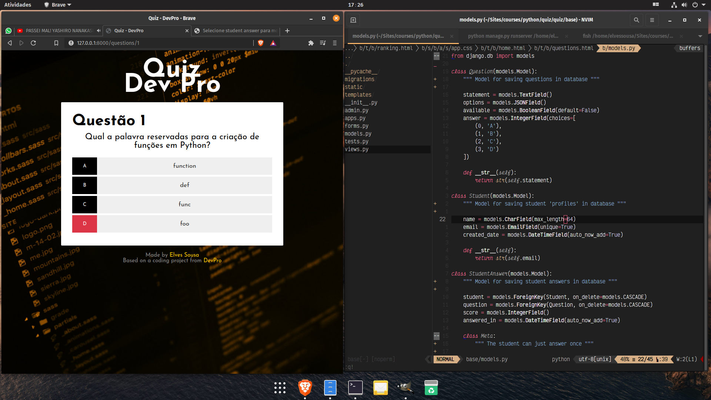

<h1 align="center">
    Quiz DevPro
</h1>

## Sobre o projeto

O **Quiz DevPro** é um quiz simples feito em Python e Django. As perguntas para o quiz não vêm no pacote, mas podem ser adicionadas pelo próprio administrador do framework no item "Questions"

---

## Tecnologias utilizadas

Esse projeto foi desenvolvido utilizando as seguintes tecnologias abaixo:

- Python
- Django
- SQLite

---

## Como contribuir

- Crie um fork deste repositório
- Faça uma branch com a sua feature: `git checkout -b minha-feature`;
- Envie suas alterações: `git commit -m 'feat: Minha nova feature'`;
- Faça um push para a sua branch: `git push origin minha-feature`.
